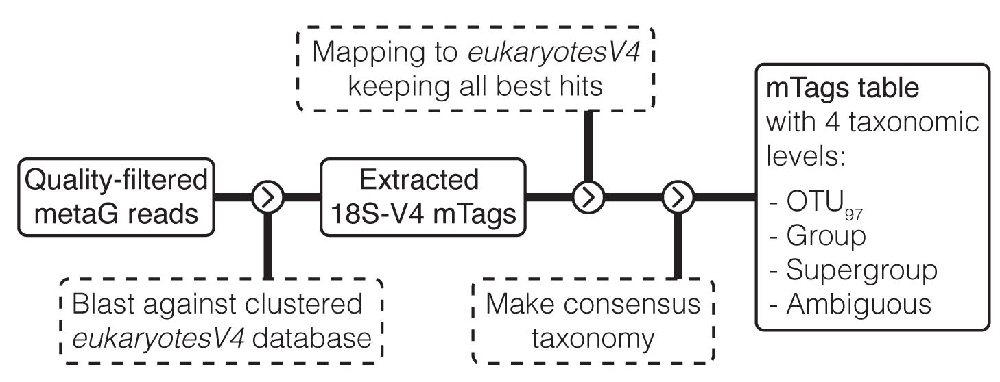

# mTags workflow with Snakemake

The main goal of this pipeline is to accurately assign taxonomy to meta-omics datasets by extracting fragments (tags) belonging to the 18S-V4 region and classifying them with [eukaryotesV4](https://github.com/aleixop/eukaryotesV4) database.

This is an improved implementation of the scripts avaiable in [this repository](https://github.com/aleixop/Malaspina_Euk_mTags). Here's an schematic view of the pipeline:



## How to run this workflow

### Step 1: clone this repository

Run this command:

```
git clone https://github.com/aleixop/mtags_snakemake.git
```

### Step 2: create an environment with the required software

First of all, if you don't have mamba installed, follow the steps explained [here](https://snakemake.readthedocs.io/en/stable/tutorial/setup.html#step-1-installing-mambaforge) to do so. 

Alternatively, you can install mamba like this:

```
conda activate base
conda install -n base -c conda-forge mamba
```

Then, activate the conda base environment with:

```
conda activate base
```

And install all required software into an isolated Conda environment with the name `mtags_snakemake` via:

```
mamba env create --name mtags_snakemake --file environment.yaml
```

### Step 3: prepare your input files

In case you want to test the pipeline, this repository contains files for testing in `data/input/`. You can remove them before processing your own samples.

You have to do 2 things prior to running this pipeline. First, put your **quality-filtered** paired-end fastq files in directory `data/input/`. **These should be gzipped and follow this naming structure**:

```
<sample1>_R1.fastq.gz
<sample1>_R2.fastq.gz
<sample2>_R1.fastq.gz
<sample2>_R2.fastq.gz
...
```

And second, open `samples.txt` file, remove its contents (samples written here are for testing only) and write your own sample names (**one line per sample name**). This should have the following structure:

```
sample1
sample2
sample3
...
```

### Step 4: run the pipeline

Activate the environment you created in [Step 2](###-step-2:-create-an-environment-with-the-required-software):

```
conda activate mtags_snakemake
```

And run the code specifying the number of threads you want to use:

```
snakemake --cores 24
```